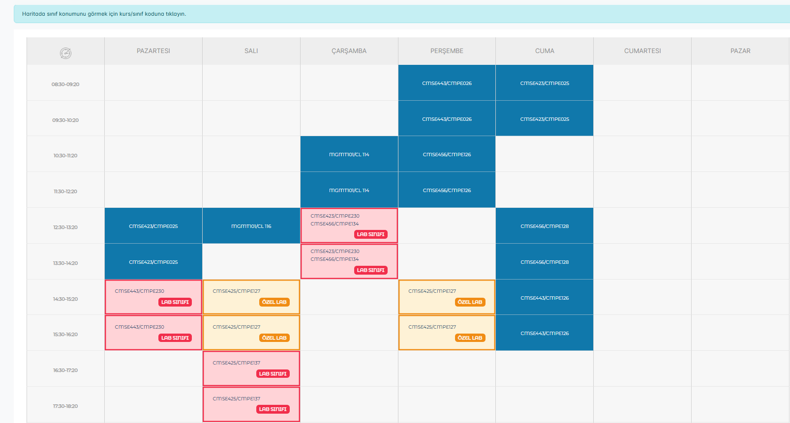

<h1 align="center">EMU LabMark</h1>

<p align="center">
  EMU öğrenci portalındaki ders programında laboratuvar derslerini
  ilk bakışta görünür kılan bir tarayıcı eklentisi.
</p>

<p align="center">
  <a href="https://github.com/Asilturkmen/Emu-Labmarker/actions/workflows/ci.yml">
    
  </a>
  <a href="LICENSE">
    
  </a>
  
  <a href="https://buymeacoffee.com/turkmenasil">
    
  </a>
</p>

---

Ders programı bütün dersleri aynı renkte gösterdiği için labları ayırt etmek oda
kodlarını ezbere bilmeyi gerektiriyor. EMU LabMark laboratuvar derslerini renkli
bir çerçeve ve kısa bir etiketle işaretler. Hangi dersin lab olduğunu tahmin
etmez; yalnızca doğrulanmış laboratuvar odalarını işaretler.

<p align="center">
  
</p>

> **Kapsam:** şu an bilgisayar mühendisliği (CMPE) laboratuvarları.

## Neleri işaretler

| | Lab sınıfı | Özel lab |
| --- | --- | --- |
| Kaynak | Eklentiyle gelen doğrulanmış liste | Kendi eklediğin sınıflar |
| Etiket | `LAB SINIFI` | `ÖZEL LAB` |
| Renk | Kırmızı | Turuncu |

Bir saatte laboratuvar dersi varsa o hücrenin tamamı işaretlenir, böylece o saat
aralığında lab olup olmadığı tek bakışta görünür. Ders programının altına da, o
programda gerçekten bulunan işaret türlerini anlatan bir açıklama satırı eklenir.

## Kurulum

Eklenti henüz mağazada yayında değil. Kullanmak için:

```bash
npm install
npm run build
```

Ardından Chrome'da `chrome://extensions` adresini aç, **Geliştirici modu**'nu
etkinleştir, **Paketlenmemiş öğe yükle**'ye bas ve `.output/chrome-mv3`
klasörünü seç.

## Kullanım

**Aç / kapa** — Eklenti simgesine tıkla ve anahtarı kullan. Kapattığında
işaretler anında kalkar, ders programı olduğu gibi kalır.

**Kendi lab sınıfını ekleme** — Bir hoca normalde lab olmayan bir sınıfı o dönem
lab olarak kullanıyorsa, oda kodunu popup'taki listeye ekle. `CMPE025` gibi bir
oda kodu da, ders programından kopyaladığın `CMSE423/CMPE025` gibi bir giriş de
kabul edilir. Bu sınıflar turuncu renkte ve `ÖZEL LAB` etiketiyle görünür,
doğrulanmış laboratuvarlarla karışmaz. Listeden çıkarmak için çipteki × işaretine
bas.

Her değişiklik açık sekmelere anında yansır; sayfayı yenilemek gerekmez.

## Gizlilik

Eklenti yalnızca ders programı sayfasını okur. Hiçbir veri toplanmaz ve hiçbir
yere gönderilmez. İstenen tek izin `storage`; o da aç/kapa tercihini ve kendi
eklediğin sınıfların listesini yalnızca senin tarayıcında saklamak için
kullanılır.

## Eksik bir laboratuvar mı var

Doğrulanmış odalar `src/data/labRooms.ts` dosyasındaki listede durur ve listeye
yalnızca gerçekten laboratuvar olduğu doğrulanmış odalar girer.

- **Kullanıcıysan:** eksik odayı popup'tan özel lab olarak ekleyebilirsin, ya da
  [bir issue aç](https://github.com/Asilturkmen/Emu-Labmarker/issues/new) —
  oda kodunu yazman yeterli.
- **Katkı vereceksen:** oda kodunu listeye ekle ve `npm test` ile doğrula.
  Boşluk ve harf büyüklüğü fark etmez (`cmpe 134` = `CMPE134`).

## Katkı

Pull request'ler açık. Göndermeden önce:

```bash
npm run typecheck && npm test
```

Testler `jsdom` üzerinde gerçek portal işaretlemesiyle çalışır, ayrıca CI aynı
üç adımı (`typecheck`, `test`, `build`) her push'ta yeniden koşar.

## Geliştirme

| Komut | |
| --- | --- |
| `npm run dev` | Geliştirme modu, canlı yeniden yükleme ile |
| `npm run build` | `.output/chrome-mv3` altına derleme |
| `npm run zip` | Mağazaya yüklenebilir arşiv |
| `npm test` | Testler |
| `npm run typecheck` | Tip denetimi |

WXT ve TypeScript ile yazıldı, Manifest V3. İçerik betiği ders programındaki
dersleri okur, oda kodlarını iki listeyle karşılaştırır ve eşleşenleri
işaretler. Portal programı kademeli yüklediği için sayfadaki değişiklikler
izlenir ve gerektiğinde yeniden taranır.

```
entrypoints/   içerik betiği ve popup
src/           ayrıştırma, sınıflandırma ve işaretleme
tests/         Vitest testleri ve portal fikstürü
docs/          mağaza metinleri ve görseller
```

## Destek

Eklenti ücretsiz ve açık kaynak. İşine yaradıysa bir kahve ısmarlayabilirsin:

<a href="https://buymeacoffee.com/turkmenasil">
  
</a>

## Lisans

MIT — ayrıntılar için [LICENSE](LICENSE).
