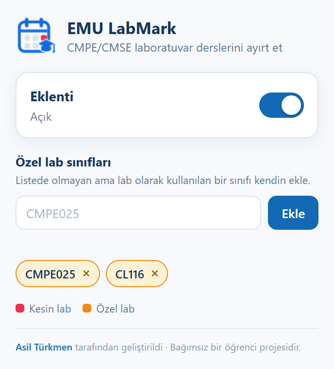

  

<h1 align="center">EMU LabMark</h1>

  Ders programında hangi ders lab, hangisi değil: bir bakışta.

  <a href="https://asilturkmen.com"><b>Asil Türkmen</b></a> Tarafından geliştirildi.

  
  
  

 

  

 

Portaldaki ders programı her dersi aynı maviyle gösteriyor. CMSE423/CMPE230 lab mı,
CMSE456/CMPE128 düz sınıf mı? Bunu anlamak için oda kodlarını ezbere bilmen lazım.
Ben de ezberlemek yerine bunu yazdım.

LabMark, lab olan saatleri kırmızı bir çerçeve ve küçük bir `LAB SINIFI` etiketiyle
işaretliyor. Geri kalan hiçbir şeye dokunmuyor. Hangi dersin lab olduğunu tahmin de
etmiyor; sadece gerçekten lab olduğu bilinen odaları işaretliyor.

## Kurulum

Chrome Web Store'a çıkınca bağlantısı buraya gelecek. O zamana kadar elle kurabilirsin:

1. [Releases](https://github.com/Asilturkmen/Emu-Labmarker/releases) sayfasından son zip'i indir, bir klasöre çıkar.
2. `chrome://extensions` adresini aç, sağ üstten **Geliştirici modu**'nu aç.
3. **Paketlenmemiş öğe yükle**'ye bas, çıkardığın klasörü seç.

Sonra ders programı sayfasını bir kez yenile, o kadar.

## Kullanım

Kurulduğu an çalışır, ayar yapmadan da işini görür. Araç çubuğundaki simgesi ders
programı sayfasındayken renkli, başka yerde gri olur. Tıklayınca açılan pencerede
iki şey var:

**Aç / kapa.** Anahtarı kapattığında işaretler anında kalkar, ders programı olduğu
gibi kalır. Sayfayı yenilemeye gerek yok.

**Kendi lab sınıfını ekleme.** Bazen hoca normalde lab olmayan bir sınıfı o dönem lab
olarak kullanıyor. Oda kodunu yaz, Ekle'ye bas.Bu sınıflar turuncu renkte ve `ÖZEL LAB`
etiketiyle görünür, kesin lablarla karışmaz. Çipin yanındaki × ile listeden çıkarabilirsiniz.

 

## Hangi odalar lab sayılıyor

Şu an listede bilgisayar mühendisliğinin (CMPE) labları var: CMPE134, 135, 136, 137,
227, 228, 230, 231, 235, 236, 238 ve 239. Hepsi doğrulanmış; tahminle eklenen yok.

Başka bölümdeysen programında kırmızı bir şey çıkmayabilir. Kendi labını yukarıdaki
gibi ekleyebilirsin, ya da [bir issue açıp](https://github.com/Asilturkmen/Emu-Labmarker/issues/new) oda kodunu yazman yeter.

## Gizlilik

Eklenti sadece `student.emu.edu.tr` üzerinde çalışır, orada da yalnızca ders programı
sayfasına bakar. Hiçbir veri toplamaz, hiçbir yere göndermez. İstediği tek izin
`storage`; o da aç/kapa tercihini ve eklediğin sınıfları kendi tarayıcında saklamak için.

## Merhaba

Ben Asil. Bu eklentiyi kendi ihtiyacımdan ortaya çıkan bağımsız bir öğrenci projesi olarak geliştirdim. Üniversitenin resmi bir ürünü değildir. Başka neler yaptığımı görmek ya da bir şey söylemek isterseneniz web sitemi ziyaret edebilirsiniz:
**[asilturkmen.com](https://asilturkmen.com)**

İşine yaradıysa bir kahve ısmarlayabilirsin:

## Lisans

MIT. Ayrıntı [LICENSE](LICENSE) dosyasında.

 

  © 2026 <a href="https://asilturkmen.com">Asil Türkmen</a>

